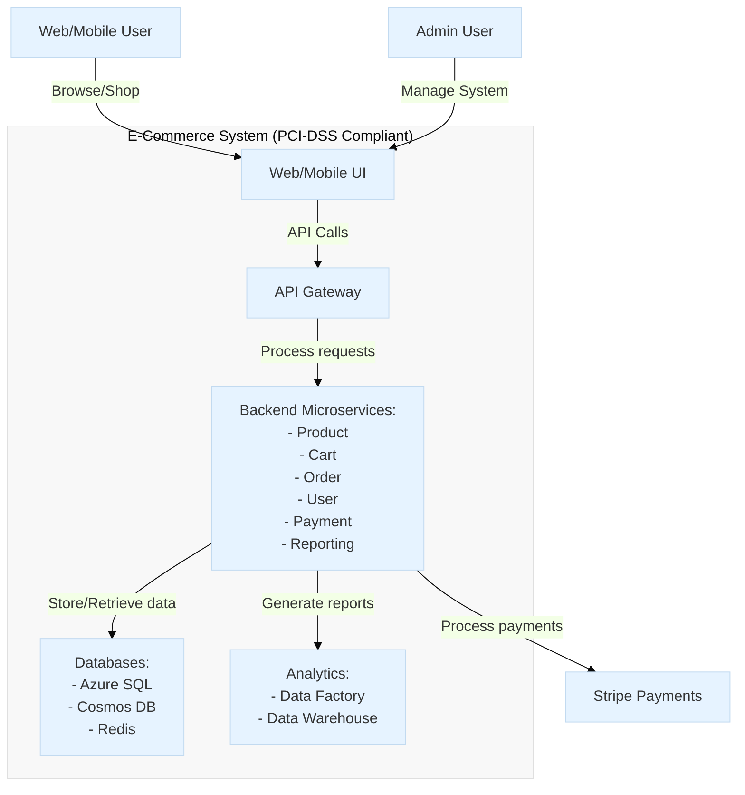
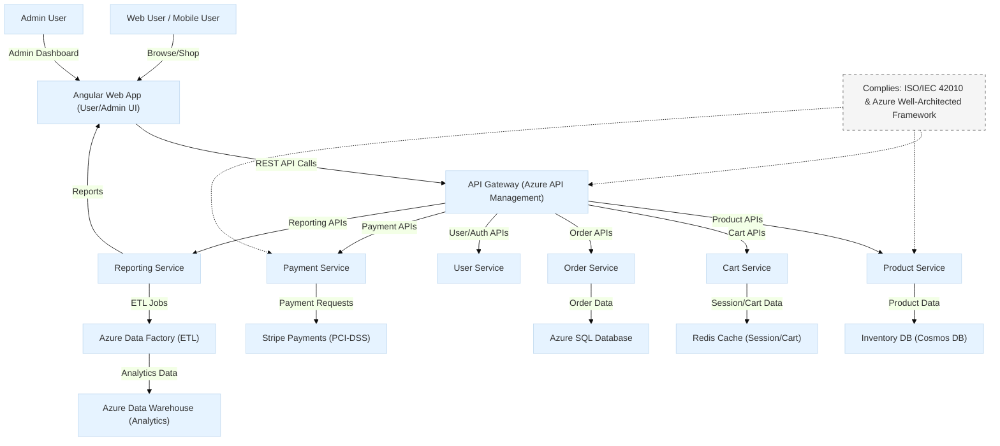
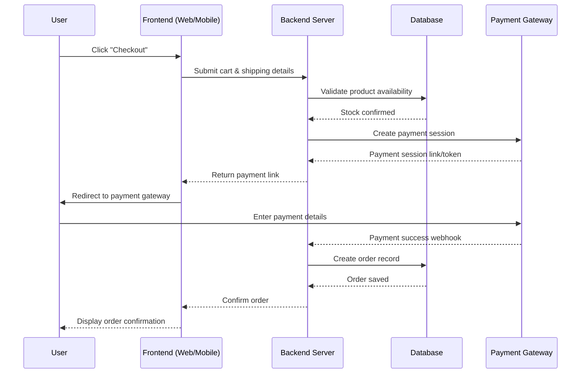
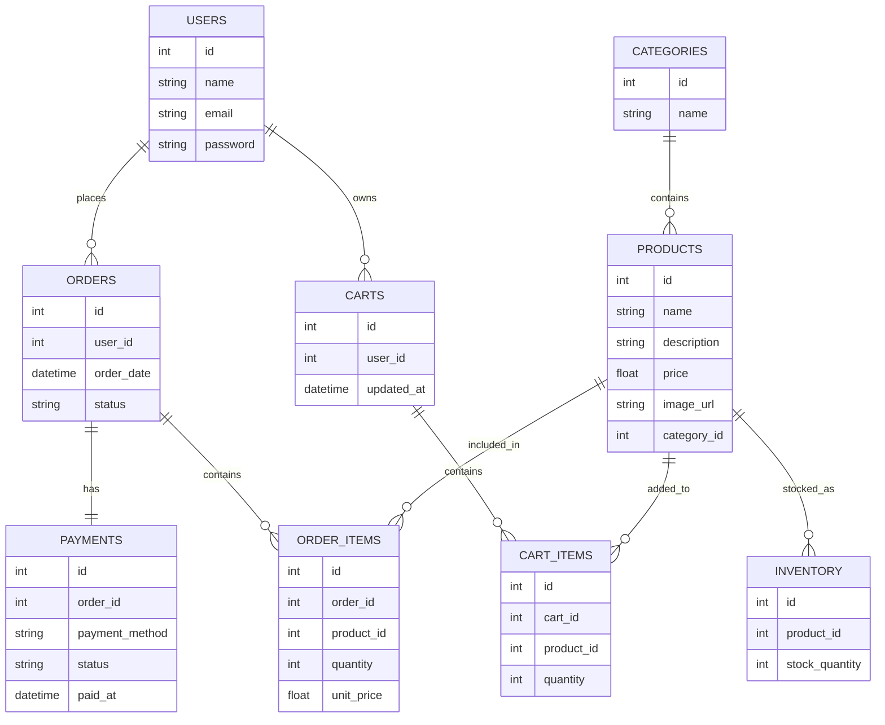

# Software Requirements Specification (SRS)

## QuickCart Shopping Cart System

- Version: **1.0**  
- Prepared by: **Andikat Jacob Dennis**
- Organization: **XYZ Software Solutions**
- Date Created: **June 25, 2025**
- ISO Standard Compliance: **ISO/IEC/IEEE 29148:2018**

## Table of Contents

1. [Revision History](#revision-history)
2. [Introduction](#1-introduction)
3. [Product Overview](#2-product-overview)
4. [Requirements](#3-requirements)
5. [Verification](#4-verification)
6. [Appendices](#5-appendices)

## Revision History

| Name                 | Date       | Reason for Changes                | Version | ISO Compliance Reference             |
| -------------------- | ---------- | --------------------------------- | ------- | ------------------------------------ |
| Andikat Jacob Dennis | 2025-06-25 | Initial Draft                     | 0.1     | Clause 5.2 (Document Control)        |
| Andikat Jacob Dennis | 2025-07-10 | ISO alignment, added traceability | 1.0     | Clause 6.1 (Requirements Attributes) |

## 1. Introduction

### 1.1 Document Purpose

This document specifies requirements for the QuickCart Shopping Cart System in compliance with ISO/IEC/IEEE 29148. It serves as a contractual agreement between stakeholders and development teams.

Target Audience:

- Developers, 
- QA
- Project Managers
- Regulatory Auditors

### 1.2 Product Scope

Objectives:

- Enable secure, scalable e-commerce transactions.
- Comply with PCI-DSS (Payment Security) and GDPR (Data Privacy).

Boundaries:

- Includes: User auth, product catalog, payment processing.
- Excludes: Warehouse logistics, third-party fulfillment.

### 1.3 Definitions, Acronyms and Abbreviations

| Term | Definition                          | ISO Reference      |
| ---- | ----------------------------------- | ------------------ |
| SRS  | Software Requirements Specification | ISO/IEC/IEEE 29148 |
| QoS  | Quality of Service (Clause 6.2.3)   | ISO 25010          |

### 1.4 References

| Title                                                                                                                     | Author/Publisher                               | Date | Version  | Link/Source                                                                                                                                            |
| ------------------------------------------------------------------------------------------------------------------------- | ---------------------------------------------- | ---- | -------- | ------------------------------------------------------------------------------------------------------------------------------------------------------ |
| ISO/IEC/IEEE 29148:2018 - Systems and software engineering - Life cycle processes - Requirements engineering              | International Organization for Standardization | 2018 | 2018     | [https://www.iso.org/standard/72089.html](https://www.iso.org/standard/72089.html)                                                                     |
| ISO/IEC 25010:2011 - Systems and software engineering - Systems and software Quality Requirements and Evaluation (SQuaRE) | ISO/IEC JTC 1/SC 7                             | 2011 | 2011     | [https://www.iso.org/standard/35733.html](https://www.iso.org/standard/35733.html)                                                                     |
| PCI DSS v4.0 - Payment Card Industry Data Security Standard                                                               | PCI Security Standards Council                 | 2022 | 4.0      | [https://docs-prv.pcisecuritystandards.org/](https://docs-prv.pcisecuritystandards.org/)                                                               |
| WCAG 2.1 - Web Content Accessibility Guidelines                                                                           | W3C                                            | 2018 | 2.1      | [https://www.w3.org/TR/WCAG21/](https://www.w3.org/TR/WCAG21/)                                                                                         |
| Microsoft Azure Well-Architected Framework                                                                                | Microsoft                                      | 2023 | 2023     | [https://learn.microsoft.com/en-us/azure/architecture/framework/](https://learn.microsoft.com/en-us/azure/architecture/framework/)                     |
| Stripe API Reference                                                                                                      | Stripe, Inc.                                   | 2023 | 2023-08  | [https://stripe.com/docs/api](https://stripe.com/docs/api)                                                                                             |
| ISO 9241-210:2019 - Ergonomics of human-system interaction - Part 210: Human-centred design for interactive systems       | ISO                                            | 2019 | 2019     | [https://www.iso.org/standard/77520.html](https://www.iso.org/standard/77520.html)                                                                     |
| OWASP Application Security Verification Standard                                                                          | OWASP Foundation                               | 2021 | 4.0.3    | [https://owasp.org/www-project-application-security-verification-standard/](https://owasp.org/www-project-application-security-verification-standard/) |
| GDPR - General Data Protection Regulation                                                                                 | European Union                                 | 2016 | 2016/679 | [https://gdpr-info.eu/](https://gdpr-info.eu/)                                                                                                         |
| ISO 27001:2022 - Information security, cybersecurity and privacy protection                                               | ISO/IEC                                        | 2022 | 2022     | [https://www.iso.org/standard/27001](https://www.iso.org/standard/27001)                                                                               |

### 1.5 Document Overview

- Section 2: Context, user needs, constraints.
- Section 3: Detailed functional/non-functional requirements.
- Section 4: Verification traceability matrix.

## 2. Product Overview

### 2.1 Product Perspective

### 2.2 Product Functions

#### 2.2.1 Customer-Facing Functions

| ID   | Function                    | Quality Attributes           | Linked Requirements | Test Cases                  |
| ---- | --------------------------- | ---------------------------- | ------------------- | --------------------------- |
| F-01 | User authentication         | Security, Usability          | FR-01, FR-02        | TC-AUTH-001 to 005          |
| F-03 | Product browsing & search   | Usability, Functionality     | FR-05, NFR-UI-01    | TC-SEARCH-001 to 003        |
| F-04 | Shopping cart management    | Functionality, Usability     | FR-07               | TC-CART-001 to 008          |
| F-05 | Secure checkout and payment | Security, Performance        | FR-10, S-01         | TC-PAY-001 to 015 (PCI DSS) |
| F-06 | Order history and tracking  | Reliability, Maintainability | FR-12               | TC-ORDER-001 to 006         |
| F-11 | Product ratings and reviews | Usability, Functionality     | FR-15               | TC-REVIEW-001 to 003        |
| F-13 | User profile management     | Usability, Security          | FR-03, S-02         | TC-PROFILE-001 to 004       |
| F-16 | Wishlists/saved items       | Functionality, Usability     | FR-18               | TC-WISHLIST-001 to 002      |
| F-19 | Returns/refund initiation   | Functionality, Usability     | FR-20               | TC-RETURNS-001 to 005       |

#### 2.2.2 Admin-Facing Functions

| ID   | Function               | Quality Attributes             | Linked Requirements | Test Cases              |
| ---- | ---------------------- | ------------------------------ | ------------------- | ----------------------- |
| F-07 | Product management     | Functionality, Maintainability | FR-30, FR-31        | TC-ADMIN-001 to 010     |
| F-14 | Session timeout/logout | Security, Reliability          | S-03                | TC-SECURITY-007 to 009  |
| F-15 | Dashboard analytics    | Functionality, Performance     | FR-35, P-03         | TC-ANALYTICS-001 to 004 |
| F-18 | Inventory alerts       | Reliability, Maintainability   | FR-25               | TC-INVENTORY-005 to 007 |

#### 2.2.3 System-Level Functions

| ID   | Function                    | Quality Attributes             | Linked Requirements | Test Cases                |
| ---- | --------------------------- | ------------------------------ | ------------------- | ------------------------- |
| F-02 | Real-time inventory checks  | Reliability, Performance       | FR-08, P-01         | TC-INVENTORY-001 to 004   |
| F-08 | Email/push notifications    | Reliability, Portability       | FR-13               | TC-NOTIFY-001 to 003      |
| F-10 | Error handling              | Reliability, Usability         | FR-09               | TC-ERROR-001 to 006       |
| F-12 | Discount/coupon support     | Functionality, Maintainability | FR-17               | TC-PROMO-001 to 003       |
| F-17 | Multi-language support      | Usability, Portability         | NFR-UI-02           | TC-L10N-001 to 005        |
| F-20 | Third-party API integration | Compatibility, Reliability     | FR-40               | TC-INTEGRATION-001 to 010 |

### 2.3 Product Constraints

- Regulatory: PCI-DSS (Credit Card Data), GDPR (User Data).
- Technical: Azure Cloud-only deployment.

### 2.4 User Characteristics

| User Role | Skill Level | Access Needs                     |
| --------- | ----------- | -------------------------------- |
| Customer  | Novice      | UI simplicity                    |
| Admin     | Expert      | Role-based access control (RBAC) |

### 2.5 Assumptions and Dependencies

- Assumption: Azure uptime SLA ≥ 99.9%.
- Dependency: Stripe API v3 (ISO 27001 certified).

### 2.6 Apportioning of Requirements

| Requirement                | Priority | Target Release |
| -------------------------- | -------- | -------------- |
| FR-01 (User Auth)          | High     | MVP (Phase 1)  |
| FR-10 (AI Recommendations) | Low      | Phase 3 (2026) |

## 3. Requirements

### 3.1 External Interfaces

### 3.1.1 User Interfaces

The QuickCart application includes two main user interface types:

- Customer Interface (Web & Mobile)
- Admin Interface (Web Only)

#### 3.1.1.1 Customer Interface Overview

The customer-facing UI is designed to provide a responsive, intuitive, and minimal e-commerce experience. Key components include:

- Homepage – Features promotions, categories, and search bar
- Product Listing Page (PLP) – Grid layout, filters (price, brand, rating), sort options
- Product Detail Page (PDP) – Product image gallery, description, stock info, “Add to Cart” button
- Shopping Cart Page – List of selected items, quantity control, price summary
- Checkout Page – Shipping address form, payment method selection, order confirmation
- User Account Pages – Order history, profile, saved addresses
- Login/Signup Forms – Accessible via modal or standalone pages

#### 3.1.1.2 Admin Interface Overview

The admin dashboard supports inventory, order, and user management. It includes:

- Login Page – Secured access with role-based authentication
- Dashboard Summary – Sales KPIs, inventory alerts, recent orders
- Product Management Page – CRUD operations on SKUs with image uploads
- Order Management Page – Order status update, refund initiation
- User Management Page – View/delete users, assign roles

#### 3.1.1.4 Usability Guidelines

- Follow WCAG 2.1 guidelines for accessibility
- Use large touch-friendly buttons for mobile devices
- Avoid cognitive overload – limit visible elements per screen
- Display clear feedback (e.g., item added to cart, form errors)

#### 3.1.1.5 Layout and Design Rules

- Grid layout using 12-column system (e.g., CSS Flexbox or CSS Grid)
- Consistent font styles, spacing, and color palette per Design System
- Use responsive design principles (media queries, fluid grids)
- Interactive elements follow Material Design or Apple HIG, depending on platform

#### 3.1.1.6 UI Design & Usability Resources

| Topic                             | Link                                                                                                                             | Notes                             |
| --------------------------------- | -------------------------------------------------------------------------------------------------------------------------------- | --------------------------------- |
| WCAG 2.1 Guidelines               | [https://www.w3.org/TR/WCAG21/](https://www.w3.org/TR/WCAG21/)                                                                   | Accessibility principles          |
| Material Design Guidelines        | [https://m3.material.io/](https://m3.material.io/)                                                                               | UI/UX components and interactions |
| Apple Human Interface Guidelines  | [https://developer.apple.com/design/human-interface-guidelines/](https://developer.apple.com/design/human-interface-guidelines/) | For iOS-native UI consistency     |
| Nielsen’s 10 Usability Heuristics | [https://www.nngroup.com/articles/ten-usability-heuristics/](https://www.nngroup.com/articles/ten-usability-heuristics/)         | UX design best practices          |
| Figma Design File Template        | [https://www.figma.com/community/file/1035203688168086460](https://www.figma.com/community/file/1035203688168086460)             | Starter UI kit for e-commerce     |

#### 3.1.2 Hardware Interfaces

| Device Type         | Usage Context                          | Notes                                   |
| ------------------- | -------------------------------------- | --------------------------------------- |
| Smartphones/Tablets | Primary platform for end users         | Android 9+ and iOS 13+ recommended      |
| Desktops/Laptops    | Used by admin users and some customers | Chrome, Firefox, Safari, Edge supported |

#### 3.1.3 Software Interfaces

| Interface           | Protocol | Data Format | QoS Requirement             | Compliance               |
| ------------------- | -------- | ----------- | --------------------------- | ------------------------ |
| Stripe Payments API | REST     | JSON        | 99.99% uptime SLA           | PCI DSS v4.0 SAQ-A       |
| Azure Service Bus   | AMQP 1.0 | Protobuf    | <100ms message latency      | ISO 27001 Annex A.14     |
| Azure Synapse       | ODBC     | Parquet     | 1TB/hr ingestion throughput | ISO/IEC 25012 (Data QoS) |

### 3.2 Functional

#### 3.2.1 Authentication

| ID    | Requirement               | Priority | Verification         | ISO Standard          |
| ----- | ------------------------- | -------- | -------------------- | --------------------- |
| FR-01 | OAuth2/JWT authentication | High     | Penetration testing  | ISO/IEC 29115 (AuthN) |
| FR-02 | MFA for admin access      | Critical | Static code analysis | ISO 27001 A.9.4.2     |

#### 3.2.2 Transaction Processing

| ID    | Requirement                 | Priority | Verification                 | ISO Standard            |
| ----- | --------------------------- | -------- | ---------------------------- | ----------------------- |
| FR-03 | Process 100 TPS (peak load) | Critical | JMeter load test (ISO 25066) | ISO 14764 (Maintenance) |
| FR-04 | <1% cart abandonment rate   | Medium   | Google Analytics tracking    | ISO 9241-11 (Usability) |

#### 3.2.3 Data Management

| ID    | Requirement                        | Priority | Verification                | ISO Standard          |
| ----- | ---------------------------------- | -------- | --------------------------- | --------------------- |
| FR-05 | GDPR right-to-erasure within 72hrs | High     | Audit logs review           | ISO 27018 (Cloud PII) |
| FR-06 | Daily encrypted backups            | Critical | Azure Backup Center reports | ISO 27001 A.12.3      |

### 3.3 Quality of Service

#### 3.3.1 Performance

| ID   | Requirement                               | Measurement Method                   | Compliance Standard     |
| ---- | ----------------------------------------- | ------------------------------------ | ----------------------- |
| P-01 | API response time <500ms (p95 latency)    | Azure Monitor (5-min sampling)       | ISO 14764 (Maintenance) |
| P-02 | System throughput: 1000 TPS sustained     | Load test (JMeter, 30-min soak test) | ISO 25066 (Usability)   |
| P-03 | 99.95% monthly uptime (excl. maintenance) | Azure SLA tracking                   | ISO 27031 (BCM)         |

Target Workloads:

- Peak: 10,000 concurrent users
- Data volume: 100K products, 1M orders/month

#### 3.3.2 Security

| ID   | Requirement                             | Verification                     | Compliance Standard    |
| ---- | --------------------------------------- | -------------------------------- | ---------------------- |
| S-01 | TLS 1.3 for all external communications | Qualys SSL Labs scan             | ISO 27001 (Annex A.14) |
| S-02 | AES-256 encryption at rest              | Azure Disk Encryption audit logs | ISO 27001 (Annex A.10) |
| S-03 | PCI-DSS compliant payment flows         | ASV quarterly scan               | PCI DSS v4.0           |

Data Protection:

- PII: Pseudonymized per GDPR Art. 4(5)
- Payment data: Never stored (Stripe tokenization)

#### 3.3.3 Reliability

| ID   | Requirement                              | Validation                         | Standard              |
| ---- | ---------------------------------------- | ---------------------------------- | --------------------- |
| R-01 | MTBF >30 days (critical components)      | Azure Service Health analytics     | ISO 9001 (Clause 8.7) |
| R-02 | Automated failover <5min (region outage) | Chaos engineering tests            | ISO 22301 (BCMS)      |
| R-03 | Zero data loss on transaction commits    | SQL Database point-in-time restore | ISO 27001 (A.12.3)    |

#### 3.3.4 Availability

| ID   | Requirement                              | Monitoring                    | SLA Reference           |
| ---- | ---------------------------------------- | ----------------------------- | ----------------------- |
| A-01 | 24/7 availability (exc. maintenance)     | Azure Application Insights    | ISO 20000-1 (Sect. 8.2) |
| A-02 | <15min RTO for critical services         | DR drill every 6 months       | ISO 22301 (BCP)         |
| A-03 | Multi-region deployment (Active/Passive) | Traffic Manager failover test | Azure Well-Architected  |

#### 3.3.5 Compliance

| Standard  | Requirement                      | Evidence                    | Audit Frequency |
| --------- | -------------------------------- | --------------------------- | --------------- |
| GDPR      | Right to erasure (Art. 17)       | Data deletion workflow logs | Annual          |
| CCPA      | Opt-out of data sale             | UI toggle + API endpoint    | Biannual        |
| ISO 27001 | Annex A.12 (Operations Security) | SOC 2 Type II report        | Quarterly       |

### 3.5 Design and Implementation

#### 3.5.1 Installation

The system supports containerized and cloud-native installations using CI/CD pipelines.

Installation Steps:

1. Clone repository:
   `git clone https://github.com/quickcart-app/quickcart.git`

2. Install dependencies:

   - Backend: `pip install -r requirements.txt`
   - Frontend: `npm install`

3. Set environment variables:
   Copy `.env.example` to `.env` and fill in secure values.

4. Run DB migrations:
   `alembic upgrade head` or `prisma migrate deploy`

5. Build & launch app:

   - Local: `docker-compose up --build`
   - Staging/Prod: Use Azure DevOps or GitHub Actions

6. Verify installation:
   `pytest` for backend and `npm run test` for frontend

Supported Environments:

- Developer (macOS/Linux/Windows)
- Staging (Docker-based)
- Production (Azure App Services, Azure PostgreSQL)

#### 3.5.2 Distribution

- Multi-region availability: App deployed across US East, EU West, and AP Southeast.
- Edge caching: Static content via CDN; reduces latency globally.
- Data sovereignty: Follows GDPR & regional compliance; user data stored regionally.
- Offline fallback (PWA): Mobile app includes limited offline mode with cache-first strategy.

#### 3.5.3 Maintainability

- Code Architecture: Layered with separation of concerns (API, services, DB, UI).
- Modular Design: Core logic split into reusable microservices.
- Logging: Centralized logging with Azure Monitor and log correlation by request ID.
- Documentation: Auto-generated API docs (Swagger/OpenAPI) + internal Wiki.
- Error Handling: Fail-fast and descriptive error reporting with fallback behaviors.
- Maintenance Tools: Admin dashboard for real-time monitoring and configuration.

#### 3.5.4 Reusability

| Component         | Description                             | Reusable In                     |
| ----------------- | --------------------------------------- | ------------------------------- |
| `auth-service`    | OAuth2, JWT, role-based auth            | Admin portal, partner APIs      |
| `checkout-module` | Stateless checkout logic                | White-label eCommerce templates |
| `product-catalog` | Fast, cached filtering/search           | Search microservices            |
| `design-system`   | Shared UI components (React + Tailwind) | CMS, onboarding flows           |

All reusable modules published to internal registries (NPM/PyPI) with versioning.

#### 3.5.5 Portability

- Cloud-native containers: Runs identically on Linux/macOS/Windows via Docker.
- Database: Compatible with PostgreSQL, MySQL (via ORM adapters).
- Cloud Agnostic: Azure by default, but can run on AWS/GCP with minor config changes.
- Front-end: React PWA works across modern browsers and mobile OSs.
- Zero vendor lock-in: Infrastructure described in Terraform.

#### 3.5.6 Cost

| Resource                                     | Monthly Cost Estimate | Provider        |
| -------------------------------------------- | --------------------- | --------------- |
| Azure App Service (Standard Tier)            | $140                 | Microsoft Azure |
| Azure PostgreSQL (General Purpose, 2 vCores) | $300                 | Microsoft Azure |
| Azure CDN (100GB/month)                      | $30                  | Microsoft Azure |
| Monitoring & Logs                            | $50                  | Azure Monitor   |
| Email/Notifications (SendGrid)               | $20                  | Twilio SendGrid |

Total Estimated Monthly Cost: $540 (excluding dev/test environments)

[Link to full cost breakdown spreadsheet](https://example.com/quickcart-costs.xlsx)

#### 3.5.7 Deadline

| Milestone             | Target Date  | Status         |
| --------------------- | ------------ | -------------- |
| Requirements Freeze   | Aug 5, 2025  | Complete    |
| Alpha Prototype (MVP) | Sep 15, 2025 | In Progress |
| Beta Testing Release  | Oct 20, 2025 | Planned        |
| Public Launch (v1.0)  | Dec 1, 2025  | Planned        |

Project follows Agile 2-week sprints; timeline updated in Jira.

#### 3.5.8 Proof of Concept

The MVP will validate:

- User registration & login
- Product browsing
- Add to cart & remove
- Checkout flow (Stripe integration)
- Order confirmation with email

Limitations:

- No admin dashboard
- No inventory sync
- Single-region deployment

## 4. Verification

### 4.1 Verification Approach

Verification ensures that the implemented system conforms to all functional and non-functional requirements as specified in Section 3.

#### Key Objectives:

- Each requirement is measurable, testable, and traceable to acceptance criteria.
- Verification activities are planned for unit, integration, system, and user acceptance levels.
- All compliance and regulatory requirements (e.g., PCI-DSS, GDPR) are validated by audit and test.

### 4.2 Testing Levels and Methods

| Test Level                    | Purpose                                                                           | Methods & Tools                                                     | Responsible Stakeholders       |
| ----------------------------- | --------------------------------------------------------------------------------- | ------------------------------------------------------------------- | ------------------------------ |
| Unit Testing                  | Verify individual components/methods (e.g., API endpoints, UI widgets).           | Automated tests (xUnit, Jest), Static code analysis                 | Developers, QA Engineers       |
| Integration Testing           | Validate interactions between components/services (e.g., API ↔ DB, API ↔ Stripe). | API integration tests (Postman, REST Assured), Service mocks        | Developers, QA Engineers       |
| System Testing                | Confirm end-to-end functionality across the whole system.                         | Automated UI tests (Selenium, Cypress), Manual exploratory testing  | QA Engineers, Test Leads       |
| User Acceptance Testing (UAT) | Ensure system meets business/user needs and is ready for production.              | UAT scripts, Business scenario walkthroughs, Stakeholder sign-off   | Product Owners, Business Users |
| Compliance Testing            | Validate regulatory and security requirements.                                    | PCI-DSS audit, GDPR data deletion tests, Security scans (OWASP ZAP) | Security/Compliance, QA        |
| Performance Testing           | Ensure system meets scalability and response time targets.                        | Load tests (JMeter, Locust), Monitoring dashboards                  | DevOps, QA                     |

### 4.3 Requirement Traceability and Test Strategy

Each requirement is mapped to a unique test case or set of cases in the Traceability Matrix (see Appendix). Below are representative examples:

| Requirement ID | Description                       | Verification Method        | Test Level         | Acceptance Criteria                        |
| -------------- | --------------------------------- | -------------------------- | ------------------ | ------------------------------------------ |
| FR-01          | OAuth2/JWT authentication         | Automated unit/integration | Unit, Integration  | 100% of valid/invalid login scenarios pass |
| FR-02          | MFA for admin access              | Static code analysis, UAT  | Integration, UAT   | MFA prompt on every admin login            |
| FR-03          | 100 TPS transaction throughput    | Load testing (JMeter)      | Performance        | 100 TPS sustained, <2% error rate          |
| FR-04          | <1% cart abandonment rate         | Analytics review           | System, UAT        | Abandonment ≤ 1% during UAT                |
| FR-10          | Secure payment (PCI-DSS)          | Penetration test, Audit    | Compliance, System | Passes PCI-DSS v4.0 checklist              |
| NFR-UI-01      | WCAG 2.1 AA accessibility         | Manual audit, Axe scan     | System, UAT        | 100% of critical flows accessible          |
| S-01           | Data encrypted at rest/in transit | Security scan, Code review | Integration        | All data stores and APIs use encryption    |
| FR-30          | Product CRUD by admin             | Automated UI/API tests     | System, UAT        | All CRUD ops succeed, audit trail present  |

### 4.4 Verification Criteria

- Test Coverage: 100% of critical and high-priority requirements have automated or manual test cases.
- Defect Rate: No open critical/blocker defects at release; <2% minor defect rate allowed.
- Performance: All APIs meet latency and throughput targets under load.
- Security: No critical vulnerabilities (OWASP Top 10) in production.
- Compliance: All regulatory requirements (PCI-DSS, GDPR) verified by audit or test.
- User Acceptance: All UAT scripts signed off by business stakeholders.

### 4.5 Defect Management and Reporting

- All defects are tracked in the project issue tracker (e.g., Azure DevOps, Jira).
- Each failed test is logged, triaged, and resolved before release.
- Regular test reports and traceability matrices are shared with stakeholders.

### 4.6 Test Artifacts

- Test Plans: Outlining scope, schedule, and responsibilities.
- Test Cases/Scripts: Linked to requirement IDs.
- Traceability Matrix: Maps requirements to verification methods and test results.
- Test Reports: Summarize execution, defects, and coverage.
- Audit Reports: For compliance and regulatory checks.

## 5. Appendices

### 5.1 Diagrams

#### 5.1.1 System Architecture Diagram

#### 5.1.2 Sequence Diagram – Checkout Flow

### 5.2 Wireframes

- [Home Page]()
- [Product Listing Page (PLP)]()
- [Product Detail Page (PDP)]()
- [Cart]()
- [Checkout]()
- [Admin Dashboard]()

### 5.3 Data Models

#### 5.3.1 Entity-Relationship Diagram (ERD)

### 5.4 Glossary

| Term | Definition                                                                 |
| ---- | -------------------------------------------------------------------------- |
| SKU  | Stock Keeping Unit – a unique identifier for each product in inventory     |
| PLP  | Product Listing Page – shows multiple products in a category               |
| PDP  | Product Detail Page – displays detailed information about a single product |
| API  | Application Programming Interface – used for backend communication         |
| UAT  | User Acceptance Testing – final stage of testing before release            |
| CRUD | Create, Read, Update, Delete – standard data management operations         |

## Approval:

| Role            | Name | Signature | Date |
| --------------- | ---- | --------- | ---- |
| Project Sponsor |      |           |      |
| QA Manager      |      |           |      |

