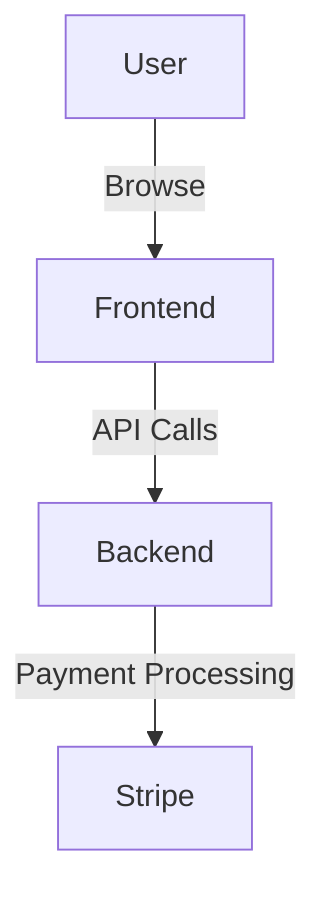
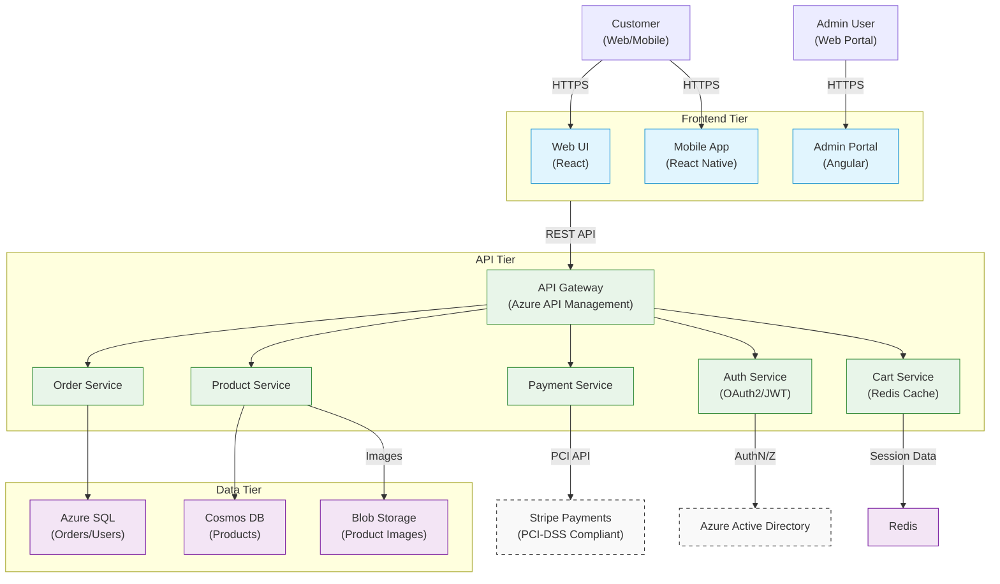
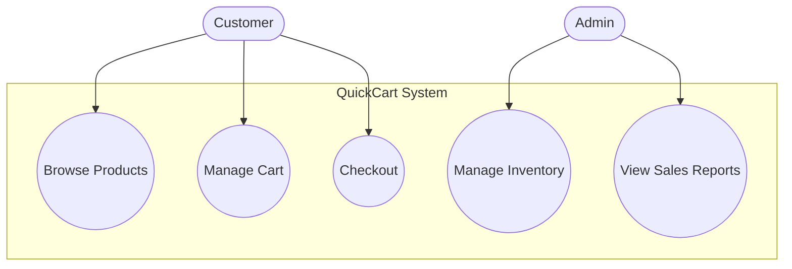
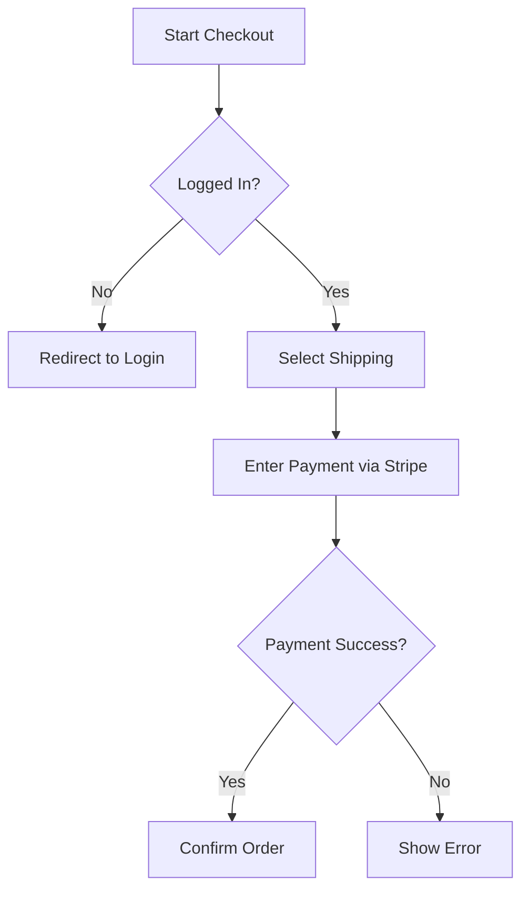
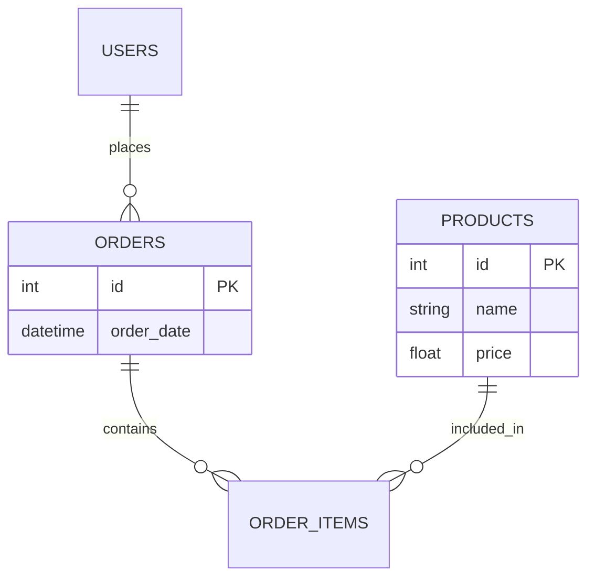

# **IEEE Software Requirements Specification (SRS) Template**

**QuickCart Shopping Cart System**

**Prepared by:**  
Andikat Jacob Dennis  
XYZ Software Solutions  
June 25, 2025

---

## **1. Introduction**

### **1.1 Purpose**

This document specifies requirements for the QuickCart Shopping Cart System, compliant with ISO/IEC/IEEE 29148. It serves as a contractual agreement between stakeholders (developers, QA, project managers) and ensures alignment with PCI-DSS, GDPR, and Azure Cloud deployment constraints.

### **1.2 Scope**

**Included:**

- User authentication (OAuth2/JWT)
- Product catalog & search
- Shopping cart management
- Secure checkout (Stripe integration)
- Order tracking & history
- Admin dashboard (product/order management)

**Excluded:**

- Warehouse logistics
- Third-party fulfillment
- Physical POS integration

### **1.3 Definitions, Acronyms, and Abbreviations**

| Term    | Definition                                   |
| ------- | -------------------------------------------- |
| SRS     | Software Requirements Specification          |
| PCI-DSS | Payment Card Industry Data Security Standard |
| GDPR    | General Data Protection Regulation           |
| PII     | Personally Identifiable Information          |

### **1.4 References**

1. ISO/IEC/IEEE 29148:2018
2. PCI DSS v4.0
3. GDPR Regulation 2016/679
4. Azure Well-Architected Framework

### **1.5 Overview**

- **Section 2**: System context, user roles, constraints.
- **Section 3**: Detailed functional/non-functional requirements.
- **Section 4**: Verification via unit/integration/compliance testing.

---

## **2. Overall Description**

### **2.1 Product Perspective**

**System Context:**

- Integrates with Stripe Payments (REST API)
- Azure-hosted (App Services, SQL Database)
- Serves web/mobile users and admin roles

**User Interactions:**

### **2.2 Product Functions**

| ID   | Function                         | Priority |
| ---- | -------------------------------- | -------- |
| F-01 | User authentication (OAuth2/JWT) | High     |
| F-05 | PCI-DSS compliant checkout       | Critical |
| F-07 | Admin product CRUD operations    | Medium   |

### **2.3 User Characteristics**

| Role     | Technical Proficiency | Needs            |
| -------- | --------------------- | ---------------- |
| Customer | Novice                | Intuitive UI     |
| Admin    | Expert                | RBAC, audit logs |

### **2.4 Constraints**

- **Regulatory**: PCI-DSS (credit card data), GDPR (PII)
- **Technical**: Azure-only deployment, TLS 1.3 mandatory

### **2.5 Assumptions and Dependencies**

- Azure uptime SLA ≥ 99.9%
- Stripe API v3 (ISO 27001 certified)

---

## **3. Specific Requirements**

### **3.1 Functional Requirements**

**FR-001: User Authentication**

- **Description**: Secure login via OAuth2/JWT
- **Inputs**: Email, password (or SSO token)
- **Processing**: Validate credentials, issue JWT
- **Outputs**: Auth token (expiry: 24h)
- **Priority**: High

**FR-010: Payment Processing**

- **Description**: PCI-DSS compliant transactions
- **Inputs**: Card details (tokenized via Stripe)
- **Processing**: Charge card, confirm payment
- **Outputs**: Payment receipt, order confirmation
- **Priority**: Critical

_(Tabular format recommended for full requirements list)_

### **3.2 Non-Functional Requirements**

#### **3.2.1 Performance**

- API response <500ms (p95) under 10K concurrent users
- Throughput: 100 TPS sustained

#### **3.2.2 Security**

- AES-256 encryption at rest
- MFA for admin access

#### **3.2.3 Usability**

- WCAG 2.1 AA compliance
- Mobile-responsive design

#### **3.2.4 Reliability**

- 99.95% monthly uptime
- Automated failover (<5min RTO)

#### **3.2.5 Compliance**

- GDPR right-to-erasure within 72h
- PCI-DSS SAQ-A validation

### **3.3 External Interface Requirements**

#### **3.3.1 User Interfaces**

- **Customer UI**: React-based PWA (mobile/desktop)
- **Admin UI**: Angular dashboard with RBAC

#### **3.3.3 Software Interfaces**

| Interface         | Protocol | Data Format |
| ----------------- | -------- | ----------- |
| Stripe API        | REST     | JSON        |
| Azure Service Bus | AMQP     | Protobuf    |

### **3.4 Data Requirements**

#### **3.4.3 Data Storage & Retention**

- PII: Encrypted, 6-month retention
- Payment data: Tokenized (never stored)

---

## **4. Verification & Validation**

### **4.1 Verification Methods**

| Requirement | Test Level       | Method           |
| ----------- | ---------------- | ---------------- |
| FR-001      | Unit/Integration | Jest, Postman    |
| FR-010      | Compliance       | PCI-DSS ASV scan |

### **4.2 Validation Criteria**

- UAT sign-off from business stakeholders
- Zero critical defects in production

---

## **5. Appendices**

### **5.1 Diagrams**

**System Architecture:**

# **5. Appendices**

## **5.1 Glossary**

| Term      | Definition                                                                        |
| --------- | --------------------------------------------------------------------------------- |
| **SKU**   | Stock Keeping Unit – Unique identifier for inventory items                        |
| **PLP**   | Product Listing Page – Displays filtered/searchable product grids                 |
| **PDP**   | Product Detail Page – Shows product images, descriptions, and "Add to Cart"       |
| **RBAC**  | Role-Based Access Control – Admin permissions tied to user roles                  |
| **PII**   | Personally Identifiable Information – Data that identifies users (GDPR-regulated) |
| **SAQ-A** | Self-Assessment Questionnaire A – PCI-DSS compliance level for Stripe integration |

---

## **5.2 Diagrams**

### **5.2.1 Use Case Diagram**

### **5.2.2 Checkout Flowchart**

### **5.2.3 ER Diagram**

## **5.3 Revision History**

| Version | Date       | Author               | Changes Made                        | ISO Compliance Reference             |
| ------- | ---------- | -------------------- | ----------------------------------- | ------------------------------------ |
| 0.1     | 2025-06-25 | Andikat Jacob Dennis | Initial draft                       | Clause 5.2 (Document Control)        |
| 1.0     | 2025-07-10 | Andikat Jacob Dennis | Added traceability, ISO alignment   | Clause 6.1 (Requirements Attributes) |
| 1.1     | 2025-08-15 | QA Team              | Updated test cases for FR-010 (PCI) | ISO/IEC 25010 (Quality Metrics)      |
