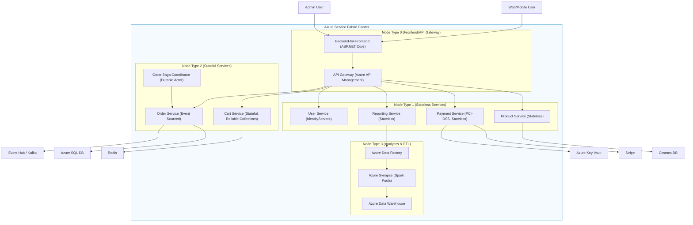

# Deployment Topology

## Deployment Topology Diagram



### **1. Product Service** (`QuickCart.ProductService.sln`)

```markdown
/ProductService
├── src/
│ ├── ProductService.API (ASP.NET Core 8)
│ │ ├── Controllers/[Product|Category]Controller.cs
│ │ ├── Models/ (DTOs)
│ │ └── Program.cs (Cosmos DB DI)
│ │
│ ├── ProductService.Domain (Class Lib)
│ │ ├── Entities/ (Aggregates)
│ │ └── Interfaces/IRepository.cs
│ │
│ └── ProductService.Infrastructure (Class Lib)
│ ├── CosmosDbRepository.cs
│ └── InventoryCache.cs (Redis)
│
├── deploy/
│ ├── ServiceManifest.xml
│ └── ApplicationManifest.xml
│
└── tests/
├── UnitTests (xUnit)
└── IntegrationTests (TestServer)
```

**Dependencies:**

- `Microsoft.Azure.Cosmos`
- `Microsoft.ServiceFabric.Services`

### **2. Cart Service** (`QuickCart.CartService.sln`)

```markdown
/CartService
├── src/
│ ├── CartService (Stateful)
│ │ ├── CartManager.cs (Reliable Dictionary)
│ │ └── Interfaces/ICartStore.cs
│ │
│ └── CartService.API (Gateway)
│ ├── CartController.cs
│ └── RedisCartStore.cs
│
├── deploy/
│ ├── Settings.xml (Partitioning)
│ └── redis.json (Connections)
│
└── tests/
└── CartService.Tests (Moq)
```

**Dependencies:**

- `Microsoft.ServiceFabric.Services.Remoting`
- `StackExchange.Redis`

### **3. Order Service** (`QuickCart.OrderService.sln`)

```markdown
/OrderService
├── src/
│ ├── OrderService (Event-Sourced)
│ │ ├── OrderAggregate.cs (DDD)
│ │ └── EventHandlers/
│ │
│ ├── OrderService.API (REST)
│ └── OrderService.Saga (Durable Actor)
│
├── deploy/
│ ├── EventHubConfig.json (Kafka)
│ └── SQLPersistence.json
│
└── tests/
└── Saga.Tests
```

### **4. Payment Service** (`QuickCart.PaymentService.sln`)

```markdown
/PaymentService
├── src/
│ ├── PaymentService (PCI-DSS)
│ │ ├── StripeAdapter.cs
│ │ └── PCIAuditLogger.cs
│ │
│ └── PaymentService.API (HTTPS)
│
├── deploy/
│ ├── PCI/ (Encrypted logs)
│ └── NetworkSecurityGroup.json
│
└── tests/
└── SecurityTests (OWASP ZAP)
```

**Dependencies:**

- `Stripe.net`
- `Microsoft.Azure.KeyVault`

### **5. User Service** (`QuickCart.UserService.sln`)

```markdown
/UserService
├── src/
│ ├── UserService.API (IdentityServer4)
│ │ ├── QuickCartProfileService.cs
│ │ └── GdprDataController.cs
│ │
│ └── UserService.Domain
│ └── Entities/User.cs (PII)
│
├── deploy/
│ ├── IdentityResources.json
│ └── Certificates/ (JWT)
│
└── tests/
└── IntegrationTests (Postman)
```

**Dependencies:**

- `IdentityServer4`
- `Microsoft.AspNetCore.DataProtection`

### **6. Reporting Service** (`QuickCart.ReportingService.sln`)

```markdown
/ReportingService
├── src/
│ ├── ReportingService (Stateless)
│ │ ├── DataExportJob.cs
│ │ └── SynapseClient.cs
│ │
│ └── ReportingService.API
│
├── deploy/
│ ├── DataFactory/ (Pipelines)
│ └── Synapse/ (Spark)
│
└── tests/
└── PerfTests
```

**Dependencies:**

- `Microsoft.Azure.Synapse`
- `Azure.Storage.Blobs`

### **Shared Components**

1. **Service Fabric Common** (`QuickCart.SFCommon.sln`)

   - Health checks
   - Reverse proxy configs

2. **Contracts** (`QuickCart.Contracts.sln`)
   - gRPC Protobufs
   - Event schemas

### **Key Benefits**

- **Independent scaling** (e.g., CartService scales for peak loads)
- **Security isolation** (PCI-compliant PaymentService)
- **Tech flexibility** (Mix of Dapr, ASP.NET Core, etc.)

Each solution maintains:

- Service/application manifests
- Environment-specific configs
- Dedicated CI/CD pipelines

### **7. Angular + .NET Frontend Solution (QuickCart.Web.sln)**

**Project Structure:**

```
/QuickCart.Web
│
├── /ClientApp (Angular 16+)
│   ├── /src/app
│   │   ├── modules
│   │   │   ├── product (PLP/PDP)
│   │   │   ├── cart (Cart Mgmt)
│   │   │   └── checkout (PCI-DSS Zone)
│   │   │
│   │   ├── core (Auth, Interceptors)
│   │   └── shared (Design System)
│   │
│   └── /assets/i18n (Multi-language)
│
├── /Server (ASP.NET Core)
│   ├── BFF (Backend-for-Frontend)
│   └── SSR (Angular Universal)
│
└── /deploy
    ├── ARM templates (Azure)
    └── Dockerfiles
```

### **8. Data Warehouse Solution (QuickCart.DataWarehouse.sln)**

**Project Structure:**

```
/QuickCart.DataWarehouse
│
├── /ETL
│   ├── ADF Pipelines (Azure Data Factory)
│   │   ├── ProductCatalog.json
│   │   └── OrderHistory.json
│   │
│   └── Synapse Notebooks (Spark)
│
├── /Database
│   ├── Azure Synapse Schema
│   │   ├── Star Schema (Fact/Dim Tables)
│   │   └── Columnstore Indexes
│   │
│   └── Power BI Embedded
│
└── /Monitoring
    ├── Databricks Delta Lake
    └── Purview Metadata
```

### **9. Supporting Solutions**

#### **4.1 API Gateway (QuickCart.Gateway.sln)**

- Azure API Management Policies
- Rate Limiting (ProductService: 1000 RPM)
- JWT Validation