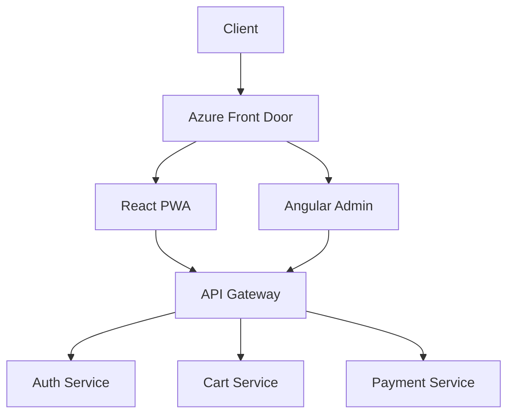
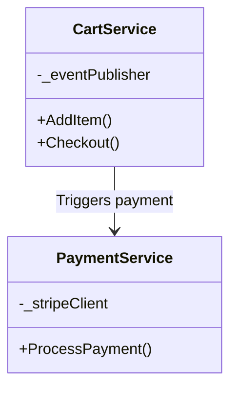
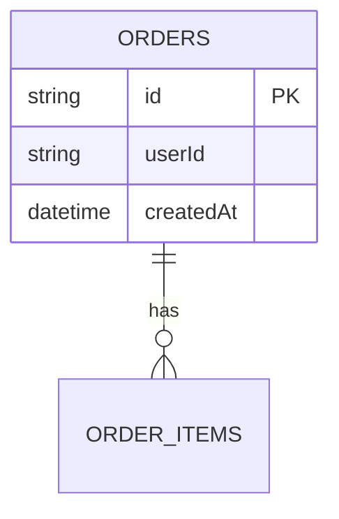
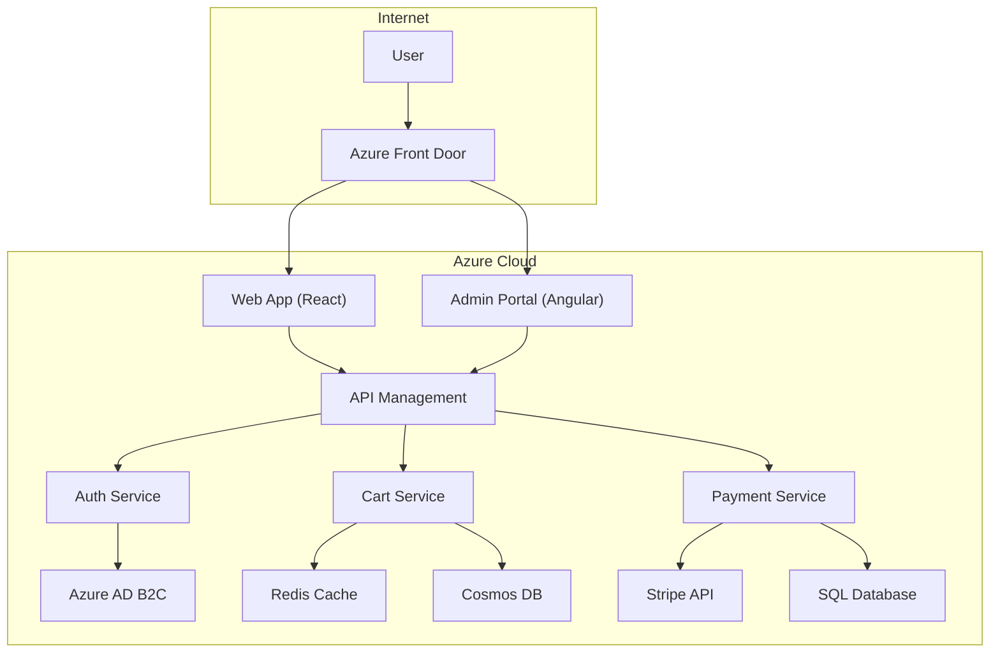
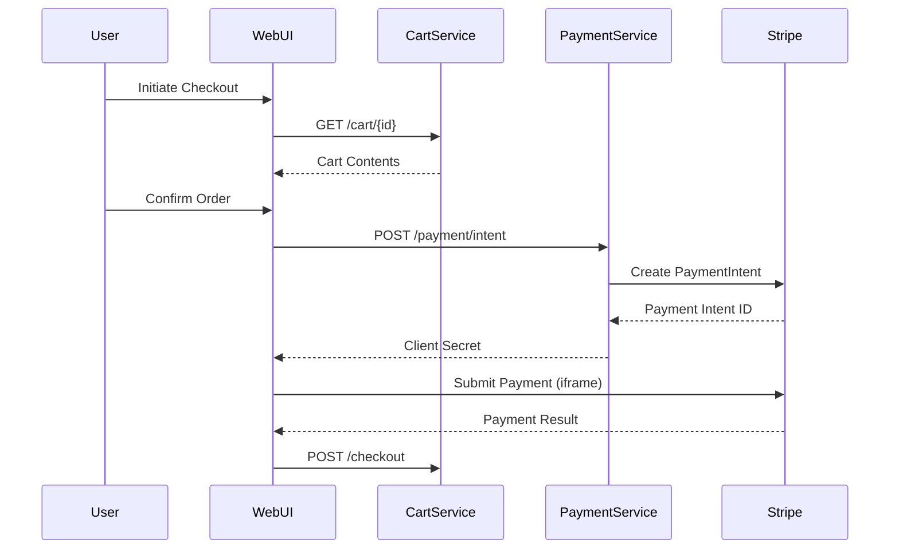

# IEEE Software Design Document (SDD)

QuickCart Shopping Cart System

Author:  
Andikat Jacob Dennis  
XYZ Software Solutions  
June 26, 2025

## 1. Introduction

### 1.1 Purpose

This document details the design of the QuickCart Shopping Cart System, translating the requirements from the IEEE 29148-compliant Software Requirements Specification (SRS) into a comprehensive technical design. It is intended for developers, architects, and QA personnel, and ensures adherence to:

- ISO 25010 (Quality Attributes)
- PCI-DSS v4.0 (Payment Security)
- Azure Well-Architected Framework

### 1.2 Scope

Inclusions:

- Microservices architecture (Authentication, Cart, Payment)
- Database design (SQL/CosmosDB)
- API specifications (REST/GraphQL)
- UI wireframes (React/Angular)

Exclusions:

- DevOps pipeline specifics
- Physical infrastructure setup

### 1.3 Definitions, Acronyms, and Abbreviations

| Term | Description                              |
| ---- | ---------------------------------------- |
| DDD  | Domain-Driven Design                     |
| CQRS | Command Query Responsibility Segregation |
| BFF  | Backend-for-Frontend (API pattern)       |

### 1.4 References

- [QuickCart SRS v1.1](#)
- [Stripe API Documentation](https://stripe.com/docs/api)
- [Microsoft Azure API Design Guidelines](https://learn.microsoft.com/en-us/azure/architecture/best-practices/api-design)

## 2. Overall Description

### 2.1 System Overview

QuickCart utilizes a cloud-native microservices architecture comprising:

- Frontend: React PWA and Angular Admin Portal
- Backend: Azure Functions (Serverless)
- Data Storage: CosmosDB (Products), SQL (Orders)
- Authentication: Azure AD B2C



### 2.2 Design Constraints

- Regulatory: PCI-DSS SAQ A-EP (Stripe iframe integration)
- Technical: Only Azure-native services permitted (no AWS/GCP)
- Performance: 95% of API calls must have latency below 500ms

### 2.3 Assumptions and Dependencies

- Azure AD uptime of at least 99.9%
- Stripe API SLA of 99.95%

## 3. System Architecture

### 3.1 High-Level Design

Architectural Patterns:

- BFF: Distinct APIs for Web and Mobile
- CQRS: Separation of command (write) and query (read) operations
- Event Sourcing: Cart events handled via Azure Event Grid



### 3.2 Subsystem Descriptions

#### 3.2.1 Auth Service

- Functionality: Implements OAuth2/OIDC, issues JWTs
- Interfaces:
  - Input: `POST /auth/token` (RFC 6749)
  - Output: JWT including `roles` claim

#### 3.2.2 Cart Service

- Functionality: Real-time cart synchronization using Redis
- Interfaces:
  - Input: `PATCH /cart/items` (JSON Patch)
  - Output: Cart snapshot with tax calculations

## 4. Detailed Design

### 4.1 Class Descriptions

#### 4.1.1 CartAggregate (Domain Layer)

```csharp
public class CartAggregate {
    public Guid Id { get; }
    public List Items { get; private set; }
    public void AddItem(Product product, int quantity) {
        // Domain logic, e.g., inventory validation
    }
}
```

### 4.2 Data Structures

Redis Cart Schema Example:

```json
{
  "sessionId": "abc123",
  "items": [{ "sku": "PROD-001", "qty": 2 }],
  "expiresAt": "2025-06-30T00:00:00Z"
}
```

### 4.3 Algorithms

Cart Total Calculation:

```python
def calculate_total(cart):
    subtotal = sum(item.price * item.qty for item in cart.items)
    tax = subtotal * 0.08  # State-specific logic
    return subtotal + tax
```

### 4.4 UI Wireframes

Checkout Process:

1. Cart Review → 2. Shipping → 3. Payment (Stripe iframe) → 4. Confirmation

### 4.5 Database Schema



## 5. Interface Design

### 5.1 External Interfaces

Stripe Payment API:

- Endpoint: `POST /v1/payment_intents`
- Headers: `Idempotency-Key`

### 5.2 Internal Interfaces

Cart to Payment Event:

```json
{
  "eventType": "CheckoutInitiated",
  "data": { "cartId": "cart_123" }
}
```

## 6. Performance Considerations

- Caching: Target 99% cache hit rate for cart reads using Redis
- Partitioning: CosmosDB partitioned by `/productCategory`

## 7. Error Handling

Exponential Backoff Retry Policy:

```yaml
stripeApi:
  maxRetries: 3
  initialDelay: 500ms
```

## 8. Security

- Data Encryption: AES-256 for personal data at rest
- Audit Logging: Azure Monitor for PCI DSS Requirement 10 compliance

## 9. Testing

Sample Test Case:

| ID       | Scenario     | Expected Outcome         |
| -------- | ------------ | ------------------------ |
| TC-PAY-1 | Expired card | Declined with error code |

## 10. Maintenance and Support

### 10.1 System Maintenance Strategy

Planned Maintenance Windows:

- Monthly Patches: 2nd Saturday of each month (02:00-04:00 UTC)
- Emergency Fixes: Hot-patch capability via Azure DevOps pipelines

Versioning Policy:

```text
API Version Format: v{MAJOR}.{MINOR}.{PATCH}
- MAJOR: Breaking changes (annual max)
- MINOR: Backward-compatible features (quarterly)
- PATCH: Bug fixes (as needed)
```

### 10.2 Update Procedures

#### 10.2.1 Zero-Downtime Deployments

1. Blue-Green Deployment:
   ```mermaid
   flowchart LR
       A[Live v1.2] -->|Traffic Shift| B[New v1.3]
       B -->|Validation| C[Rollback if errors]
   ```
2. Database Migrations:
   - Flyway for schema changes
   - Critical data: Dual-write during transition

#### 10.2.2 Dependency Updates

| Component      | Update Frequency | Verification Method         |
| -------------- | ---------------- | --------------------------- |
| Azure Services | Auto-patched     | Azure Health Dashboard      |
| NPM Packages   | Weekly           | Snyk/Dependabot scans       |
| Stripe API     | Quarterly        | Sandbox compatibility tests |

### 10.3 Troubleshooting Guide

Common Issues Matrix:

| Symptom                      | Root Cause                  | Resolution Steps                                                      |
| ---------------------------- | --------------------------- | --------------------------------------------------------------------- |
| Cart items disappearing      | Redis cache eviction        | 1. Check cache memory metrics<br>2. Adjust Redis persistence settings |
| Payment failures (Error 402) | Stripe API version mismatch | 1. Verify API version in config<br>2. Update Stripe.NET library       |
| Slow product searches        | CosmosDB RU exhaustion      | 1. Scale RU allocation<br>2. Add composite indexes                    |

Logging Standards:

```json
// Sample structured log entry
{
  "timestamp": "2025-07-15T14:32:45Z",
  "service": "CartService",
  "correlationId": "cid-789abc",
  "severity": "ERROR",
  "message": "Inventory reservation failed",
  "context": {
    "cartId": "cart_XYZ123",
    "missingSku": "PROD-888"
  }
}
```

### 10.4 Support Model

Tiered Support Structure:

| Tier | Response SLA | Channel         | Escalation Path     |
| ---- | ------------ | --------------- | ------------------- |
| L1   | <1 hour      | Helpdesk portal | L2 Support Engineer |
| L2   | <15 minutes  | Teams/Slack     | Development Lead    |
| L3   | Immediate    | PagerDuty       | Architect/CTO       |

Monitoring Tools:

- Application: Azure Application Insights
- Infrastructure: Prometheus + Grafana
- Business: Power BI dashboards

## Appendices

### A1. Detailed Architecture Diagrams

#### A1.1 Microservices Deployment View



#### A1.2 Sequence Diagram: Checkout Process



### A2. Additional Pseudocode

#### A2.1 Cart Service - Inventory Reservation

```python
def reserve_inventory(cart_items):
    try:
        with transaction.atomic():
            for item in cart_items:
                product = Product.objects.select_for_update().get(id=item.product_id)
                if product.stock < item.quantity:
                    raise InsufficientStockError
                product.stock -= item.quantity
                product.save()
            return True
    except DatabaseError:
        log_retry(cart_items)
        raise InventoryReservationFailed
```

#### A2.2 Payment Service - Idempotency Handler

```java
public class IdempotencyHandler {
    private final Cache cache; // Redis-backed

    public Response processPayment(Request request, String idempotencyKey) {
        if (cache.exists(idempotencyKey)) {
            return cache.get(idempotencyKey);
        }

        Response response = stripeClient.processPayment(request);
        cache.put(idempotencyKey, response, TTL_24HRS);
        return response;
    }
}
```

### A3. Glossary of Technical Terms

| Term            | Definition                                                                              |
| --------------- | --------------------------------------------------------------------------------------- |
| CQRS            | Command Query Responsibility Segregation - Pattern separating read and write operations |
| BFF             | Backend for Frontend - Dedicated API layer per client type (Web/Mobile)                 |
| Event Sourcing  | Design pattern where state changes are stored as a sequence of events                   |
| Idempotency Key | Unique client-generated key to prevent duplicate operations                             |
| PLP             | Product Listing Page - Grid view of search/filter results                               |
| PDP             | Product Detail Page - Individual product view with add-to-cart                          |

### A4. Revision History

| Version | Date       | Author               | Changes                     | Approver           |
| ------- | ---------- | -------------------- | --------------------------- | ------------------ |
| 0.1     | 2025-06-25 | A. Dennis            | Initial draft               | -                  |
| 1.0     | 2025-06-28 | A. Dennis            | Added microservice diagrams | QA Team            |
| 1.1     | 2025-07-02 | S. Patel (Architect) | Revised payment flow        | CTO                |
| 2.0     | 2025-07-10 | A. Dennis            | Final release candidate     | Steering Committee |

### A5. Supplementary Materials

1. Azure Resource Templates  
   [Gist link] - ARM templates for deployment

2. Swagger API Documentation  
   [API Docs URL] - Interactive OpenAPI specs

3. UI Design System  
   [Figma Link] - Component library and style guide

4. PCI-DSS Attestation  
   [Internal doc #SEC-105] - Compliance evidence for SAQ A-EP

5. Load Test Results
   ```text
   Test Date: 2025-07-05
   Scenario: 10,000 concurrent checkouts
   Result: Avg latency 427ms @ 99th percentile
   ```
