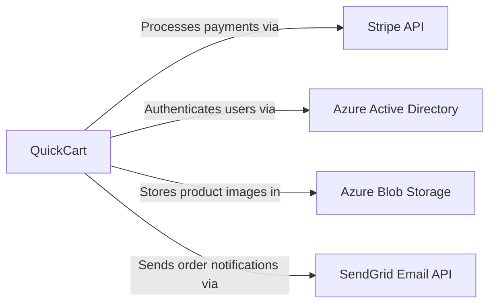
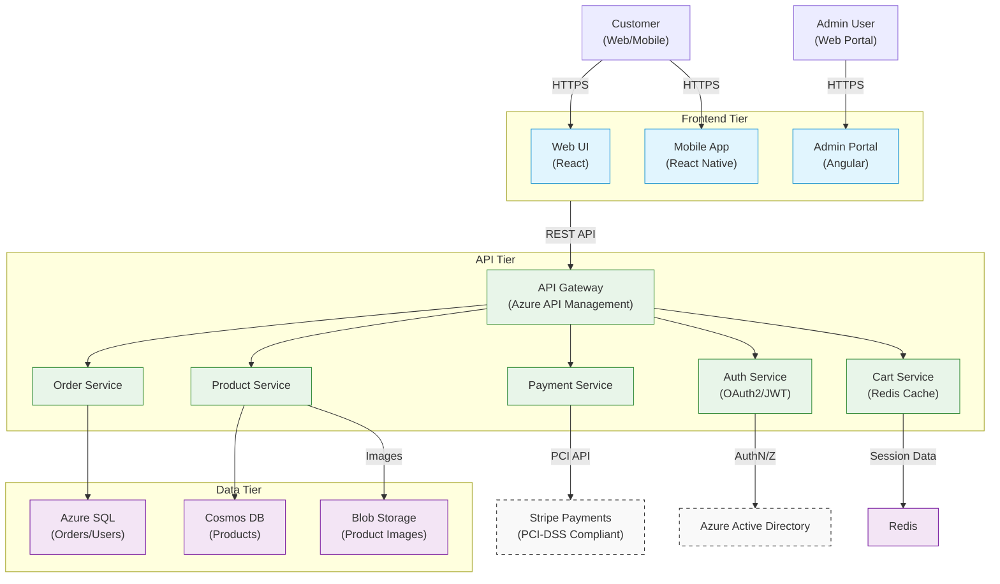
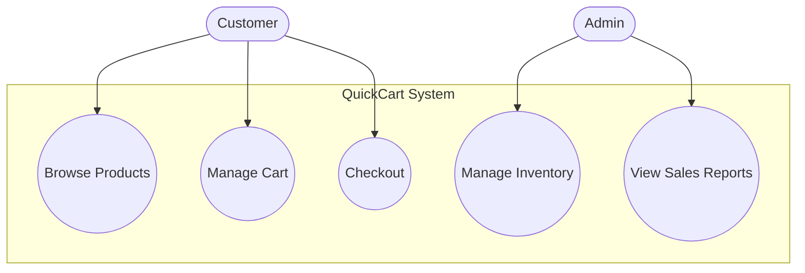
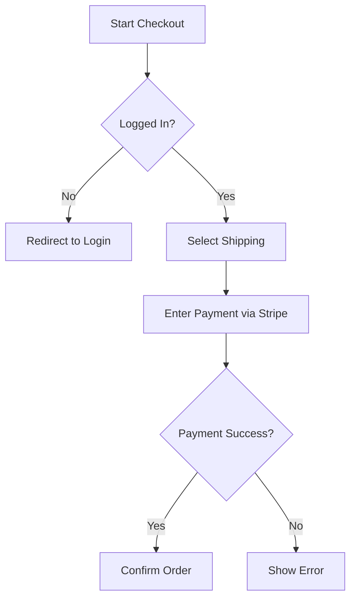
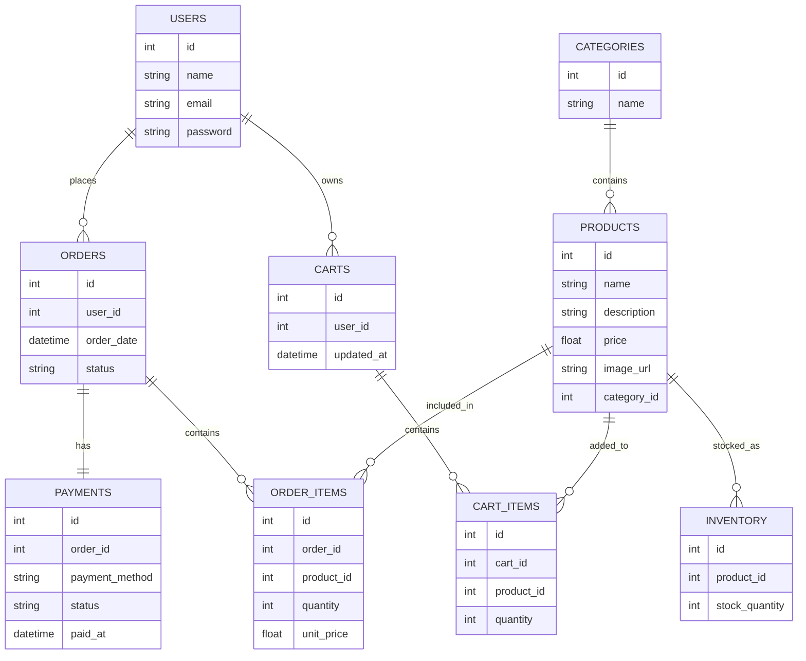

# **IEEE Software Requirements Specification (SRS)**

**QuickCart Shopping Cart System**

**Prepared by:**  
Andikat Jacob Dennis  
XYZ Software Solutions  
June 25, 2025

---

## **1. Introduction**

### **1.1 Purpose**

This document specifies requirements for the QuickCart Shopping Cart System, compliant with ISO/IEC/IEEE 29148. It serves as a contractual agreement between stakeholders (developers, QA, project managers) and ensures alignment with PCI-DSS, GDPR, and Azure Cloud deployment constraints.

### **1.2 Scope**

**Included:**

- User authentication (OAuth2/JWT)
- Product catalog & search
- Shopping cart management
- Secure checkout (Stripe integration)
- Order tracking & history
- Admin dashboard (product/order management)

**Excluded:**

- Warehouse logistics
- Third-party fulfillment
- Physical POS integration

### **1.3 Definitions, Acronyms, and Abbreviations**

| Term    | Definition                                   |
| ------- | -------------------------------------------- |
| SRS     | Software Requirements Specification          |
| PCI-DSS | Payment Card Industry Data Security Standard |
| GDPR    | General Data Protection Regulation           |
| PII     | Personally Identifiable Information          |

### **1.4 References**

| Title                                                                                                                     | Author/Publisher                               | Date | Version  | Link/Source                                                                                                                                            |
| ------------------------------------------------------------------------------------------------------------------------- | ---------------------------------------------- | ---- | -------- | ------------------------------------------------------------------------------------------------------------------------------------------------------ |
| ISO/IEC/IEEE 29148:2018 - Systems and software engineering - Life cycle processes - Requirements engineering              | International Organization for Standardization | 2018 | 2018     | [https://www.iso.org/standard/72089.html](https://www.iso.org/standard/72089.html)                                                                     |
| ISO/IEC 25010:2011 - Systems and software engineering - Systems and software Quality Requirements and Evaluation (SQuaRE) | ISO/IEC JTC 1/SC 7                             | 2011 | 2011     | [https://www.iso.org/standard/35733.html](https://www.iso.org/standard/35733.html)                                                                     |
| PCI DSS v4.0 - Payment Card Industry Data Security Standard                                                               | PCI Security Standards Council                 | 2022 | 4.0      | [https://docs-prv.pcisecuritystandards.org/](https://docs-prv.pcisecuritystandards.org/)                                                               |
| WCAG 2.1 - Web Content Accessibility Guidelines                                                                           | W3C                                            | 2018 | 2.1      | [https://www.w3.org/TR/WCAG21/](https://www.w3.org/TR/WCAG21/)                                                                                         |
| Microsoft Azure Well-Architected Framework                                                                                | Microsoft                                      | 2023 | 2023     | [https://learn.microsoft.com/en-us/azure/architecture/framework/](https://learn.microsoft.com/en-us/azure/architecture/framework/)                     |
| Stripe API Reference                                                                                                      | Stripe, Inc.                                   | 2023 | 2023-08  | [https://stripe.com/docs/api](https://stripe.com/docs/api)                                                                                             |
| ISO 9241-210:2019 - Ergonomics of human-system interaction - Part 210: Human-centred design for interactive systems       | ISO                                            | 2019 | 2019     | [https://www.iso.org/standard/77520.html](https://www.iso.org/standard/77520.html)                                                                     |
| OWASP Application Security Verification Standard                                                                          | OWASP Foundation                               | 2021 | 4.0.3    | [https://owasp.org/www-project-application-security-verification-standard/](https://owasp.org/www-project-application-security-verification-standard/) |
| GDPR - General Data Protection Regulation                                                                                 | European Union                                 | 2016 | 2016/679 | [https://gdpr-info.eu/](https://gdpr-info.eu/)                                                                                                         |
| ISO 27001:2022 - Information security, cybersecurity and privacy protection                                               | ISO/IEC                                        | 2022 | 2022     | [https://www.iso.org/standard/27001](https://www.iso.org/standard/27001)                                                                               |

### **1.5 Overview**

- **Section 2**: System context, user roles, constraints.
- **Section 3**: Detailed functional/non-functional requirements.
- **Section 4**: Verification via unit/integration/compliance testing.

## **2. Overall Description**

## **2.1 Product Perspective**

### **System Context**

QuickCart operates as a cloud-native e-commerce platform with these key relationships:



### **User Roles and Interactions**

| Role         | Interaction                                                                              | Interface              |
| ------------ | ---------------------------------------------------------------------------------------- | ---------------------- |
| **Customer** | <ul><li>Browse products</li><li>Manage shopping cart</li><li>Complete checkout</li></ul> | Web/Mobile UI (React)  |
| **Admin**    | <ul><li>Manage inventory</li><li>Process refunds</li><li>View analytics</li></ul>        | Admin Portal (Angular) |
| **System**   | <ul><li>Sync inventory</li><li>Generate reports</li></ul>                                | Automated cron jobs    |

### **Hardware/Software Dependencies**

#### **Mandatory Dependencies**

| Component             | Minimum Requirement | Purpose                        |
| --------------------- | ------------------- | ------------------------------ |
| **Cloud Platform**    | Microsoft Azure     | Hosting infrastructure         |
| **Payment Processor** | Stripe API v3       | PCI-DSS compliant transactions |
| **Identity Provider** | Azure AD            | OAuth2 authentication          |

### **2.2 Product Functions**

#### 2.2.1 Customer-Facing Functions

| ID     | Function                    | Quality Attributes           | Linked Requirements | Test Cases                  |
| ------ | --------------------------- | ---------------------------- | ------------------- | --------------------------- |
| F-C-01 | User authentication         | Security, Usability          | FR-01, FR-02        | TC-AUTH-001 to 005          |
| F-C-02 | Product browsing & search   | Usability, Functionality     | FR-05, NFR-UI-01    | TC-SEARCH-001 to 003        |
| F-C-03 | Shopping cart management    | Functionality, Usability     | FR-07               | TC-CART-001 to 008          |
| F-C-04 | Secure checkout and payment | Security, Performance        | FR-10, S-01         | TC-PAY-001 to 015 (PCI DSS) |
| F-C-05 | Order history and tracking  | Reliability, Maintainability | FR-12               | TC-ORDER-001 to 006         |
| F-C-06 | Product ratings and reviews | Usability, Functionality     | FR-15               | TC-REVIEW-001 to 003        |
| F-C-07 | User profile management     | Usability, Security          | FR-03, S-02         | TC-PROFILE-001 to 004       |
| F-C-08 | Wishlists/saved items       | Functionality, Usability     | FR-18               | TC-WISHLIST-001 to 002      |
| F-C-09 | Returns/refund initiation   | Functionality, Usability     | FR-20               | TC-RETURNS-001 to 005       |

#### 2.2.2 Admin-Facing Functions

| ID     | Function               | Quality Attributes             | Linked Requirements | Test Cases              |
| ------ | ---------------------- | ------------------------------ | ------------------- | ----------------------- |
| F-A-01 | Product management     | Functionality, Maintainability | FR-30, FR-31        | TC-ADMIN-001 to 010     |
| F-A-02 | Session timeout/logout | Security, Reliability          | S-03                | TC-SECURITY-007 to 009  |
| F-A-03 | Dashboard analytics    | Functionality, Performance     | FR-35, P-03         | TC-ANALYTICS-001 to 004 |
| F-A-04 | Inventory alerts       | Reliability, Maintainability   | FR-25               | TC-INVENTORY-005 to 007 |

#### 2.2.3 System-Level Functions

| ID     | Function                    | Quality Attributes             | Linked Requirements | Test Cases                |
| ------ | --------------------------- | ------------------------------ | ------------------- | ------------------------- |
| F-S-01 | Real-time inventory checks  | Reliability, Performance       | FR-08, P-01         | TC-INVENTORY-001 to 004   |
| F-S-02 | Email/push notifications    | Reliability, Portability       | FR-13               | TC-NOTIFY-001 to 003      |
| F-S-03 | Error handling              | Reliability, Usability         | FR-09               | TC-ERROR-001 to 006       |
| F-S-04 | Discount/coupon support     | Functionality, Maintainability | FR-17               | TC-PROMO-001 to 003       |
| F-S-05 | Multi-language support      | Usability, Portability         | NFR-UI-02           | TC-L10N-001 to 005        |
| F-S-06 | Third-party API integration | Compatibility, Reliability     | FR-40               | TC-INTEGRATION-001 to 010 |

### **2.3 User Characteristics**

| Role     | Technical Proficiency | Needs            |
| -------- | --------------------- | ---------------- |
| Customer | Novice                | Intuitive UI     |
| Admin    | Expert                | RBAC, audit logs |

### **2.4 Constraints**

- **Regulatory**: PCI-DSS (credit card data), GDPR (PII)
- **Technical**: Azure-only deployment, TLS 1.3 mandatory

### **2.5 Assumptions and Dependencies**

- Azure uptime SLA ≥ 99.9%
- Stripe API v3 (ISO 27001 certified)

## **3. Specific Requirements**

### **3.1 Functional Requirements**

#### **F-C-01: User Authentication**

##### **FR-01: Multi-Factor Authentication**

- **Description**: Secure login requiring email/password + OTP verification
- **Inputs**:
  - Email (format validation)
  - Password (8+ chars, special char required)
  - OTP (6-digit via SMS/authenticator)
- **Processing**:
  - Verify credentials against Azure AD
  - Validate OTP (30s timeout)
  - Generate JWT with RBAC claims
- **Outputs**:
  - Access token (JWT, 24h expiry)
  - Session audit log entry
- **Priority**: Critical
- **Test Cases**: TC-AUTH-001 (success), TC-AUTH-002 (invalid OTP), TC-AUTH-003 (expired session)

##### **FR-02: Social Login**

- **Description**: OAuth2 integration with Google/Facebook
- **Inputs**: OAuth token from provider
- **Processing**:
  - Validate token signature
  - Match/merge existing account
  - Enforce GDPR consent
- **Outputs**:
  - JWT with source identifier
  - First-time user profile setup
- **Priority**: High
- **Compliance**: GDPR Art. 7, ISO/IEC 29115

#### **F-C-02: Product Browsing & Search**

##### **FR-05: Faceted Search**

- **Description**: Filter products by 10+ attributes
- **Inputs**:
  - Search query (min 2 chars)
  - Selected filters (price, brand, rating)
- **Processing**:
  - Elasticsearch query with fuzzy matching
  - Apply inventory availability filter
- **Outputs**:
  - Paginated results (20 items/page)
  - Filter summary breadcrumbs
- **Priority**: High
- **Performance**: <500ms response @ 1000 RPS

##### **FR-06: Product Recommendations**

- **Description**: AI-powered "You May Also Like" suggestions
- **Inputs**:
  - User browsing history
  - Cart contents
- **Processing**:
  - Azure Personalizer API call
  - Fallback to popularity-based
- **Outputs**:
  - 3-5 recommended products
  - Tracking pixel for analytics
- **Priority**: Medium
- **Test Cases**: TC-SEARCH-002 (cold start), TC-SEARCH-003 (personalized)

#### **F-C-03: Shopping Cart Management**

##### **FR-07: Cart Synchronization**

- **Description**: Real-time cart across devices
- **Inputs**:
  - User ID (authenticated)
  - Anonymous session token (guest)
- **Processing**:
  - Redis cache updates
  - Conflict resolution (last-write-wins)
- **Outputs**:
  - Unified cart view
  - Item availability alerts
- **Priority**: High
- **Data Model**:
  ```mermaid
  classDiagram
    class Cart {
      +string sessionId
      +List~CartItem~ items
      +DateTime updatedAt
    }
  ```

##### **FR-08: Bulk Cart Operations**

- **Description**: Add/remove multiple items at once
- **Inputs**:
  - Product SKU list
  - Quantities (default: 1)
- **Processing**:
  - Atomic inventory checks
  - Batch price validation
- **Outputs**:
  - Success/failure per item
  - Updated cart total
- **Priority**: Medium
- **Edge Cases**: TC-CART-007 (partial failure)

#### **F-C-04: Secure Checkout & Payment**

##### **FR-10: PCI-Compliant Checkout**

- **Description**: Tokenized payment flow
- **Inputs**:
  - Stripe Elements iframe data
  - Billing address
- **Processing**:
  - PCI-DSS validated iframe
  - Address verification (AVS)
  - 3D Secure challenge
- **Outputs**:
  - Payment intent ID
  - Receipt PDF
- **Priority**: Critical
- **Compliance**: PCI DSS SAQ A-EP

##### **FR-11: Fraud Screening**

- **Description**: Real-time risk analysis
- **Inputs**:
  - User behavior fingerprints
  - Transaction patterns
- **Processing**:
  - Azure Fraud Detection API
  - Rules engine evaluation
- **Outputs**:
  - Approve/Review/Decline status
  - Risk score (0-100)
- **Priority**: High
- **Test Cases**: TC-PAY-014 (false positive handling)

#### **Traceability Matrix**

| Function ID | Covered FRs  | Test Coverage | Compliance Links  |
| ----------- | ------------ | ------------- | ----------------- |
| F-C-01      | FR-01, FR-02 | 5 test cases  | ISO 27001 A.9.4.2 |
| F-C-02      | FR-05, FR-06 | 8 test cases  | WCAG 2.1 AA       |
| F-C-03      | FR-07, FR-08 | 12 test cases | Azure SLA §4.3    |
| F-C-04      | FR-10, FR-11 | 15 test cases | PCI DSS Req.3.2   |

### **3.2 Non-Functional Requirements**

#### **3.2.1 Performance**

- API response <500ms (p95) under 10K concurrent users
- Throughput: 100 TPS sustained

#### **3.2.2 Security**

- AES-256 encryption at rest
- MFA for admin access

#### **3.2.3 Usability**

- WCAG 2.1 AA compliance
- Mobile-responsive design

#### **3.2.4 Reliability**

- 99.95% monthly uptime
- Automated failover (<5min RTO)

#### **3.2.5 Compliance**

- GDPR right-to-erasure within 72h
- PCI-DSS SAQ-A validation

### **3.3 External Interface Requirements**

#### **3.3.1 User Interfaces**

- **Customer UI**: React-based PWA (mobile/desktop)
- **Admin UI**: Angular dashboard with RBAC

#### **3.3.3 Software Interfaces**

| Interface         | Protocol | Data Format |
| ----------------- | -------- | ----------- |
| Stripe API        | REST     | JSON        |
| Azure Service Bus | AMQP     | Protobuf    |

### **3.4 Data Requirements**

#### **3.4.3 Data Storage & Retention**

- PII: Encrypted, 6-month retention
- Payment data: Tokenized (never stored)

## **4. Verification & Validation**

### **4.1 Verification Methods**

| Requirement | Test Level       | Method           |
| ----------- | ---------------- | ---------------- |
| FR-001      | Unit/Integration | Jest, Postman    |
| FR-010      | Compliance       | PCI-DSS ASV scan |

### **4.2 Validation Criteria**

- UAT sign-off from business stakeholders
- Zero critical defects in production

---

## **5. Appendices**

### **5.1 Diagrams**

**System Architecture:**



# **5. Appendices**

## **5.1 Glossary**

| Term      | Definition                                                                        |
| --------- | --------------------------------------------------------------------------------- |
| **SKU**   | Stock Keeping Unit – Unique identifier for inventory items                        |
| **PLP**   | Product Listing Page – Displays filtered/searchable product grids                 |
| **PDP**   | Product Detail Page – Shows product images, descriptions, and "Add to Cart"       |
| **RBAC**  | Role-Based Access Control – Admin permissions tied to user roles                  |
| **PII**   | Personally Identifiable Information – Data that identifies users (GDPR-regulated) |
| **SAQ-A** | Self-Assessment Questionnaire A – PCI-DSS compliance level for Stripe integration |

---

## **5.2 Diagrams**

### **5.2.1 Use Case Diagram**



### **5.2.2 Checkout Flowchart**



### **5.2.3 ER Diagram**



## **5.3 Revision History**

| Version | Date       | Author               | Changes Made                        | ISO Compliance Reference             |
| ------- | ---------- | -------------------- | ----------------------------------- | ------------------------------------ |
| 0.1     | 2025-06-25 | Andikat Jacob Dennis | Initial draft                       | Clause 5.2 (Document Control)        |
| 1.0     | 2025-07-10 | Andikat Jacob Dennis | Added traceability, ISO alignment   | Clause 6.1 (Requirements Attributes) |
| 1.1     | 2025-08-15 | QA Team              | Updated test cases for FR-010 (PCI) | ISO/IEC 25010 (Quality Metrics)      |
